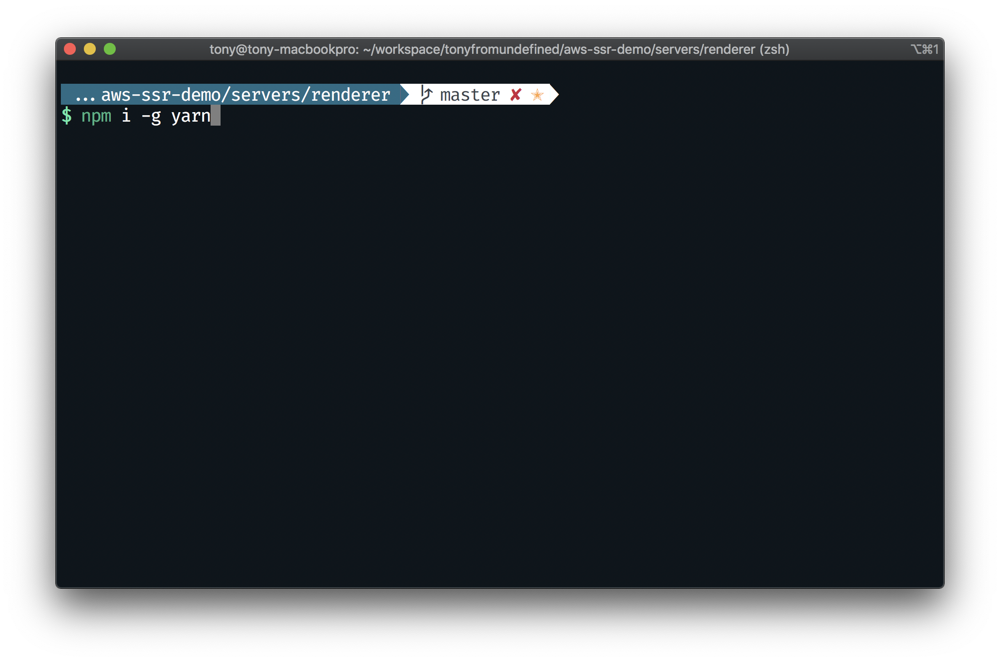
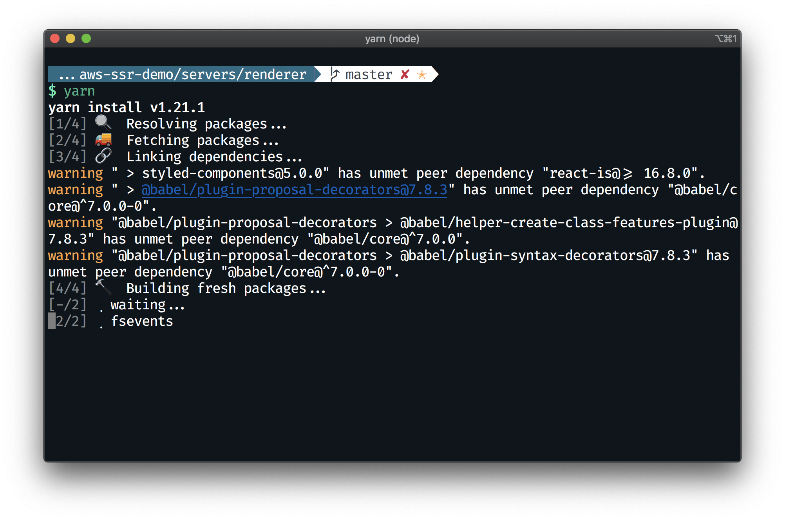
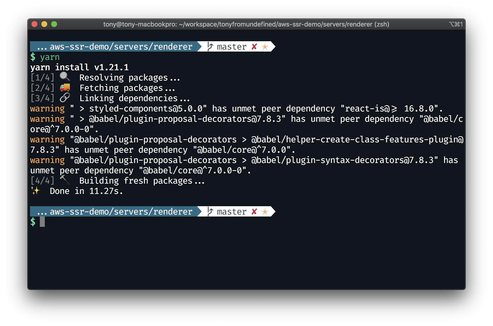
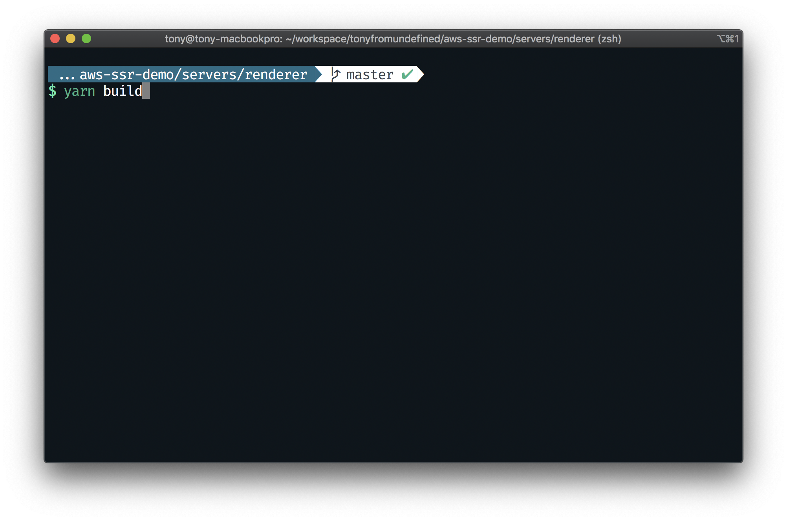
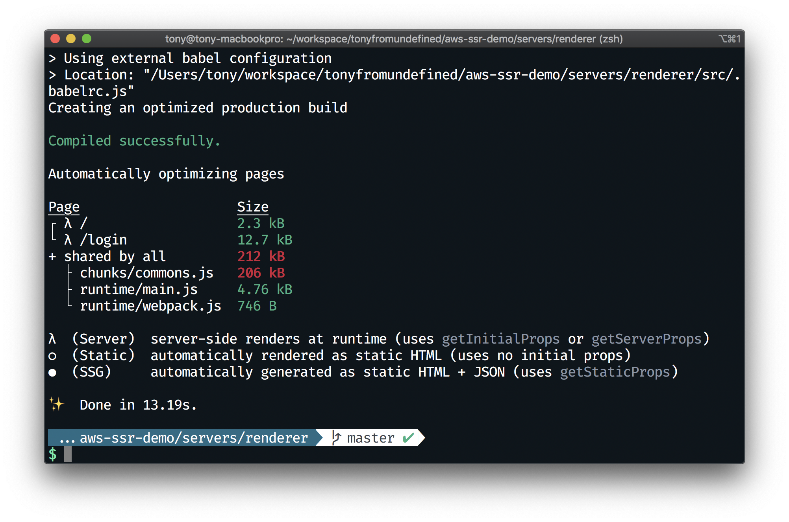

# 의존성 설치 및 프로젝트 빌드하기
- 만약, 기존에 `yarn`이 설치되어 있지 않다면, 다음 명령어를 통해 `yarn`을 설치합니다.
  ```bash
  $ npm i -g yarn
  ```
  

- `/servers/renderer` 폴더로 이동한 뒤, 다음 명령어로 의존성을 설치합니다.
  ```bash
  $ yarn
  ```
  
  
  

- 다음 명령어로 어플리케이션을 빌드합니다
  ```bash
  $ yarn build
  ```
  
  

## 다음으로
0. 의존성 설치 및 프로젝트 빌드하기
1. **IAM 사용자 만들기** [이동하기](../1_iam/README.md)
2. EB CLI를 통해 EB 어플리케이션 만들기
3. EB CLI를 통해 EB 환경 만들기
4. ElastiCache(Redis) 만들고 EB와 연결하기
5. EB에 환경변수 주입하기
6. CloudFront로 정적 자원 제공 가속화하기
