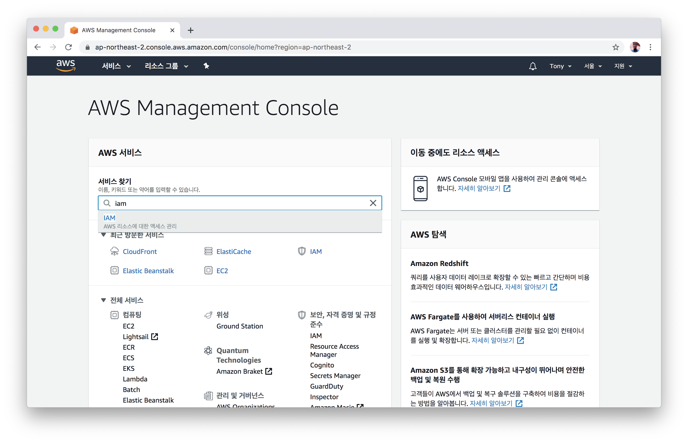
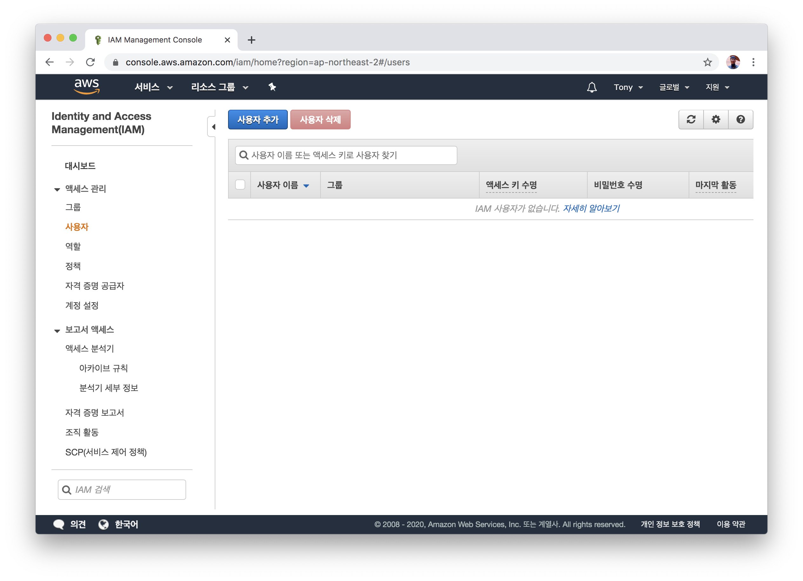
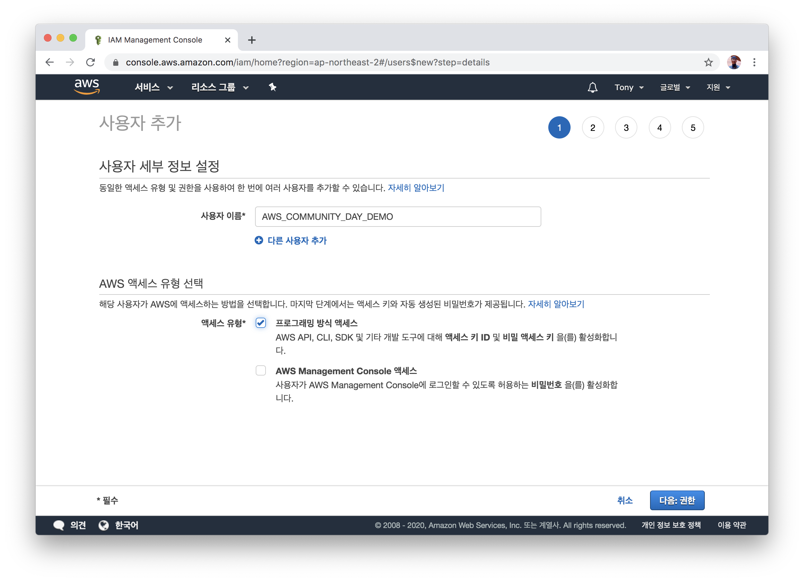
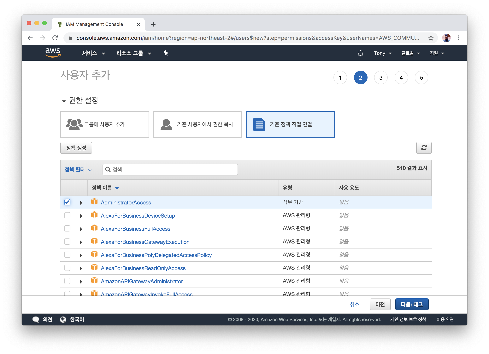
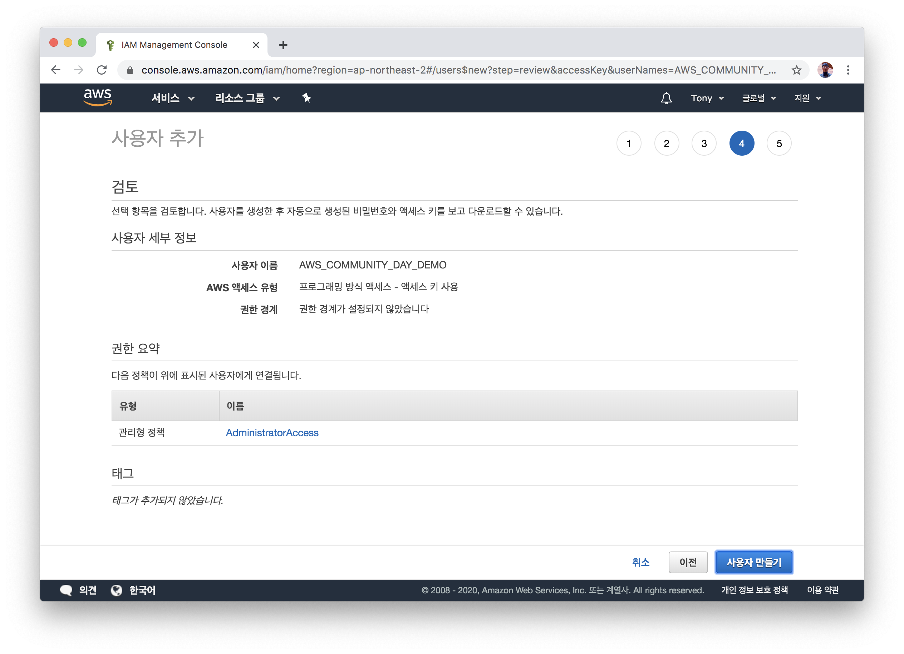
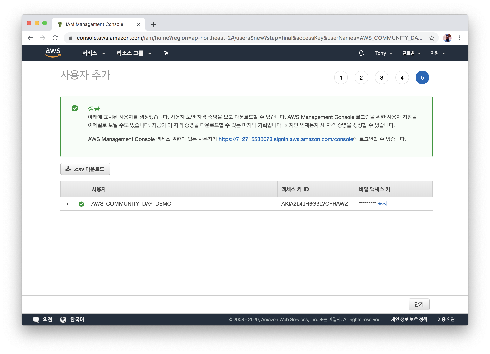
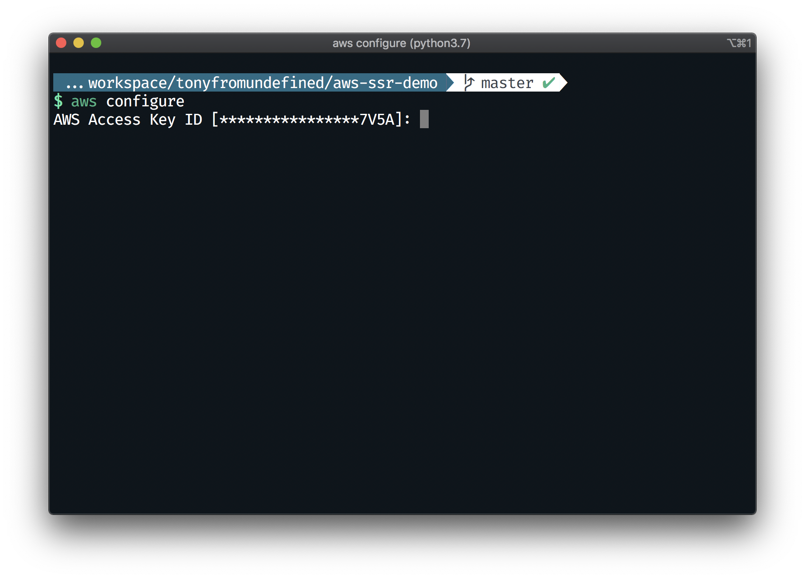
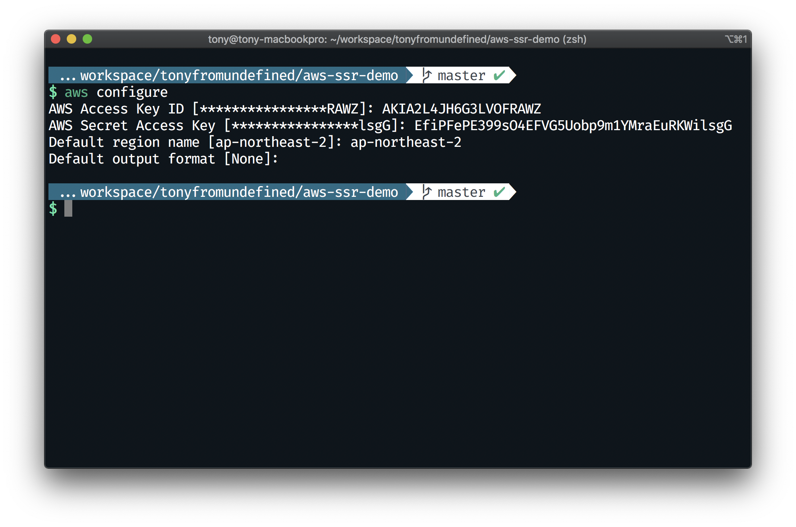

# IAM 사용자 만들기
- AWS Console 내에서 `IAM` 항목으로 이동합니다
  

- `사용자` 탭으로 이동해 `사용자 추가`를 클릭합니다
  

- `사용자 이름`에 `AWS_COMMUNITY_DAY_DEMO`를 입력하고, `프로그래밍 방식 액세스`에 체크합니다.
- 하단의 `다음: 권한`을 클릭합니다.
  

- `기존 정책 직접 연결`을 선택한 뒤, `AdministratorAccess`를 선택합니다.
  > ⚠️ 본 데모에서는 편의를 위해 `AdministratorAccess` 권한을 사용합니다. 보안상의 문제가 있을 수 있으므로 실제 사용환경에서는 필요한 권한만 선택하여 사용하도록 합니다.
- 하단의 `다음: 태그`를 클릭합니다.

  

- `다음: 검토`를 클릭합니다.
  

- `사용자 만들기`를 클릭합니다.
  

- `액세스 키 ID`와 `비밀 액세스 키`를 확인합니다. (이 창을 떠나지 않습니다)
  > ⚠️ `액세스 키 ID`와 `비밀 액세스 키`가 인터넷에 노출될 경우 해커에 의해 AWS 자원이 사용되어 수천, 수만 달러가 과금되거나, AWS에 의해서 계정이 정지될수 있습니다. 해당 값이 GitHub 등 소스 저장소에 업로드하지 않도록 각별히 주의합니다.

  

- 다음 명령어로 내 컴퓨터에 생성한 AWS 사용자를 등록합니다.
  ```bash
  $ aws configure
  ```
  
  

## 다음으로
0. 의존성 설치 및 프로젝트 빌드하기
1. IAM 사용자 만들기
2. **EB CLI를 통해 EB 어플리케이션 만들기** [이동하기](../documents/2_eb_init/README.md)
3. EB CLI를 통해 EB 환경 만들기
4. ElastiCache(Redis) 만들고 EB와 연결하기
5. EB에 환경변수 주입하기
6. CloudFront로 정적 자원 제공 가속화하기
