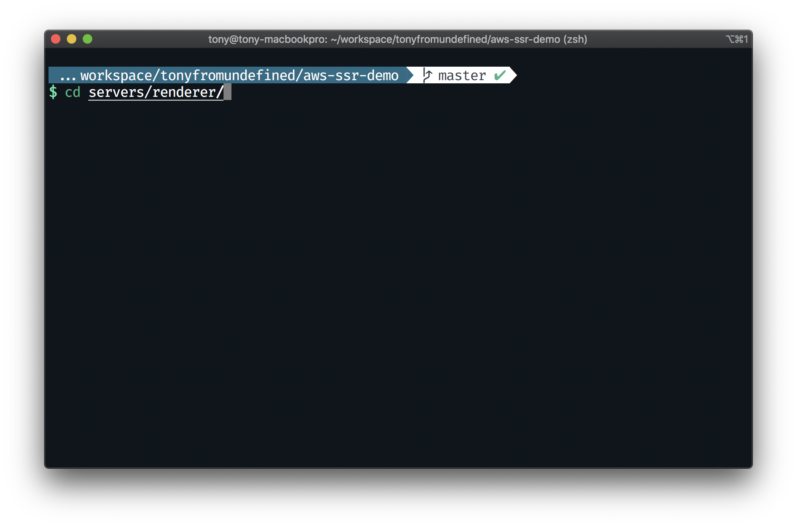
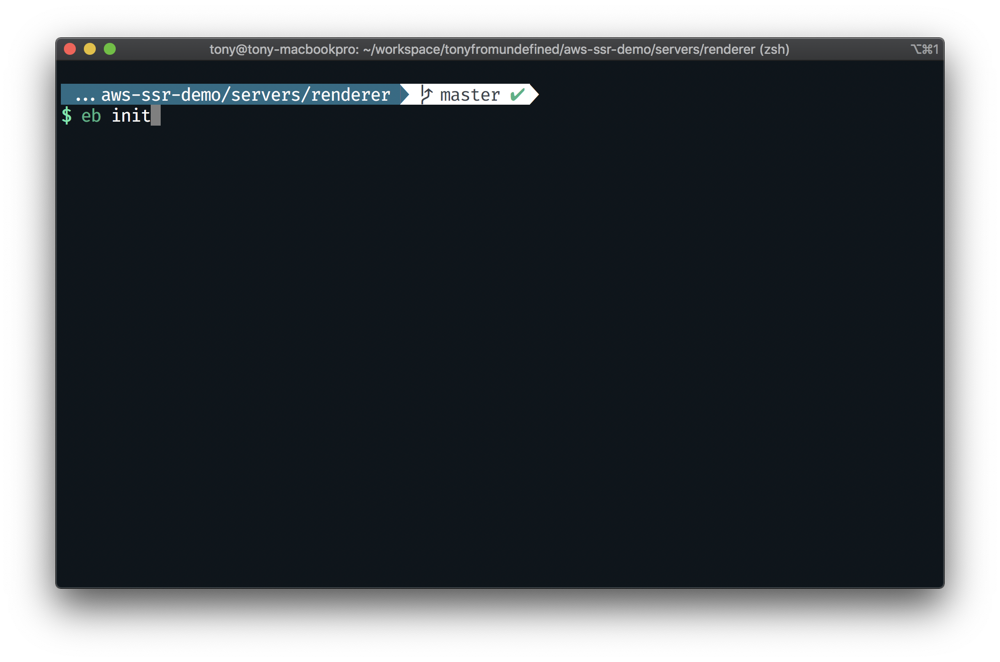
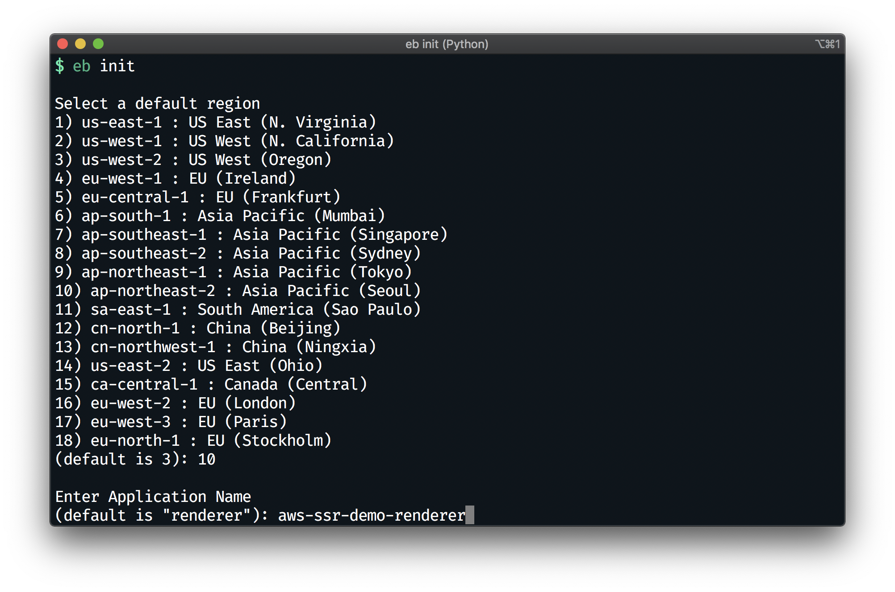
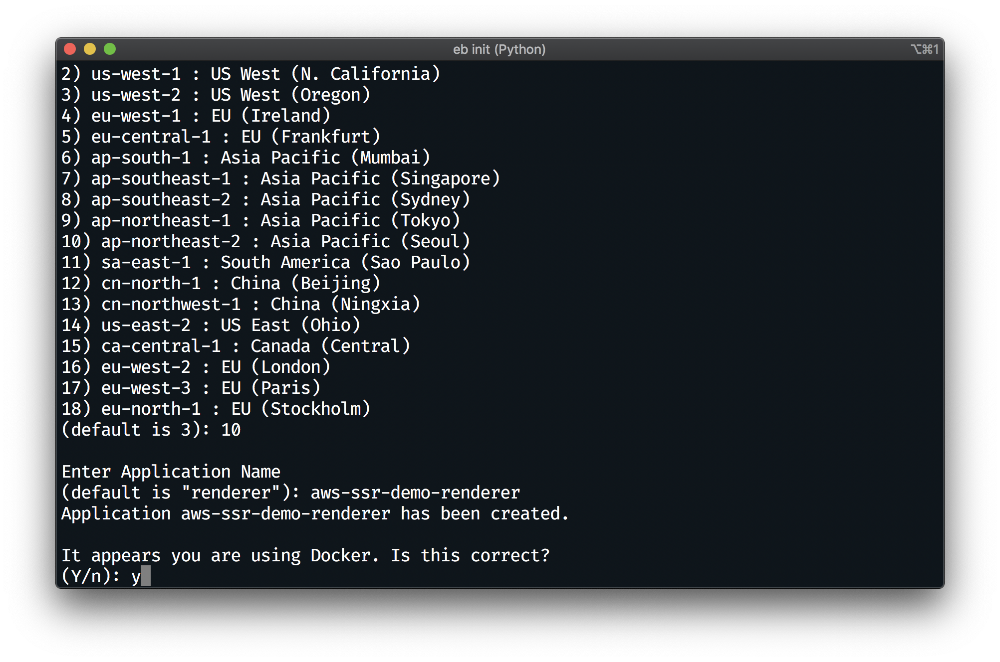
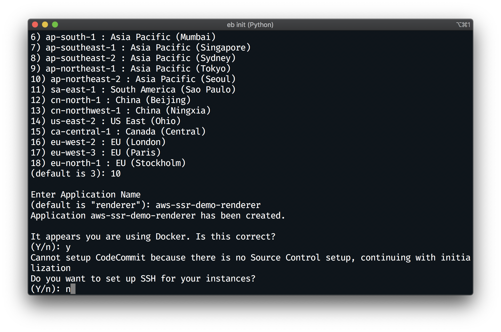

# EB CLI를 통해 EB 어플리케이션 만들기
- `servers/renderer` 폴더로 이동합니다.
  

- 다음 명령어를 통해 EB 어플리케이션을 생성합니다.
  ```bash
  $ eb init
  ```
  

- `ap-northeast-2`(서울 리전)을 선택해줍니다
  

- 어플리케이션 이름에 `aws-ssr-demo-renderer`를 적습니다.
  

- Docker를 사용여부를 질문하면 `y`로 대답합니다.
  

- SSH 연결 여부를 질문하면 `n`로 대답합니다.
  

## 다음으로
0. 의존성 설치 및 프로젝트 빌드하기
1. IAM 사용자 만들기
2. EB CLI를 통해 EB 어플리케이션 만들기
3. **EB CLI를 통해 EB 환경 만들기** [이동하기](../documents/3_eb_create/README.md)
4. ElastiCache(Redis) 만들고 EB와 연결하기
5. EB에 환경변수 주입하기
6. CloudFront로 정적 자원 제공 가속화하기
