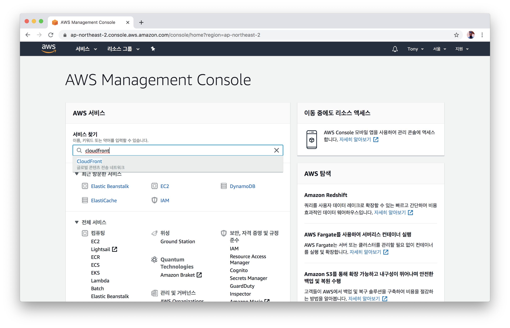
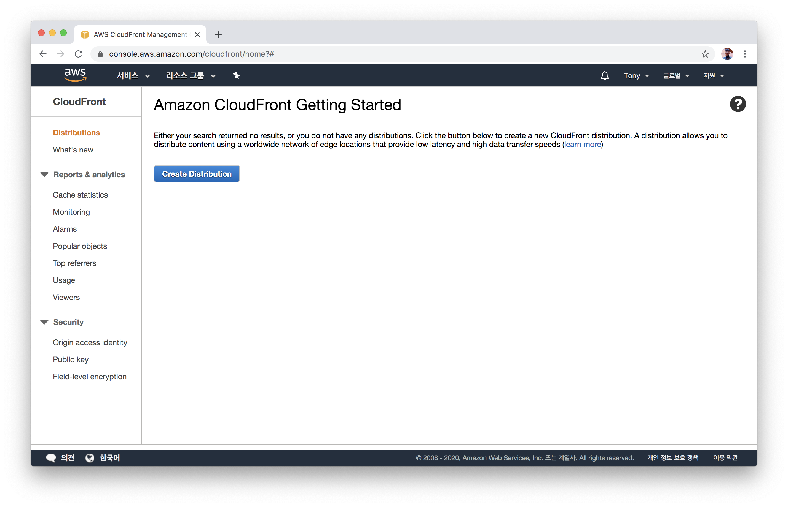
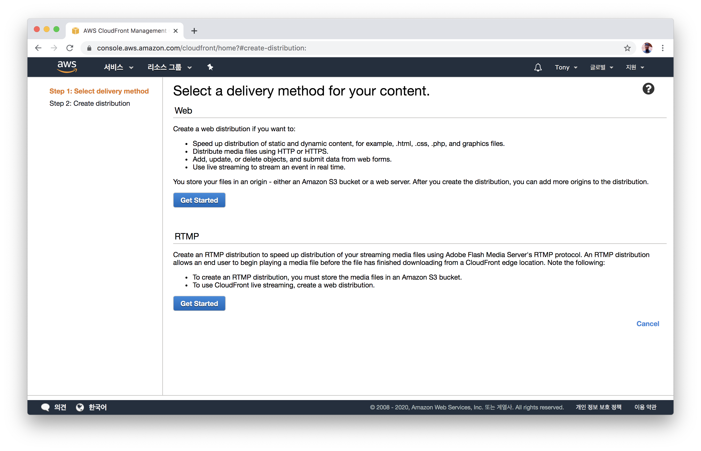
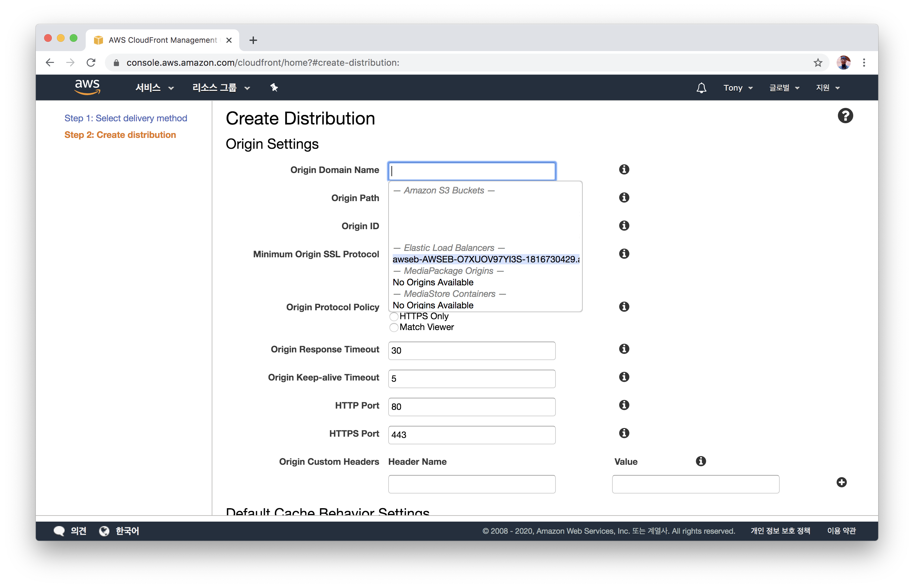
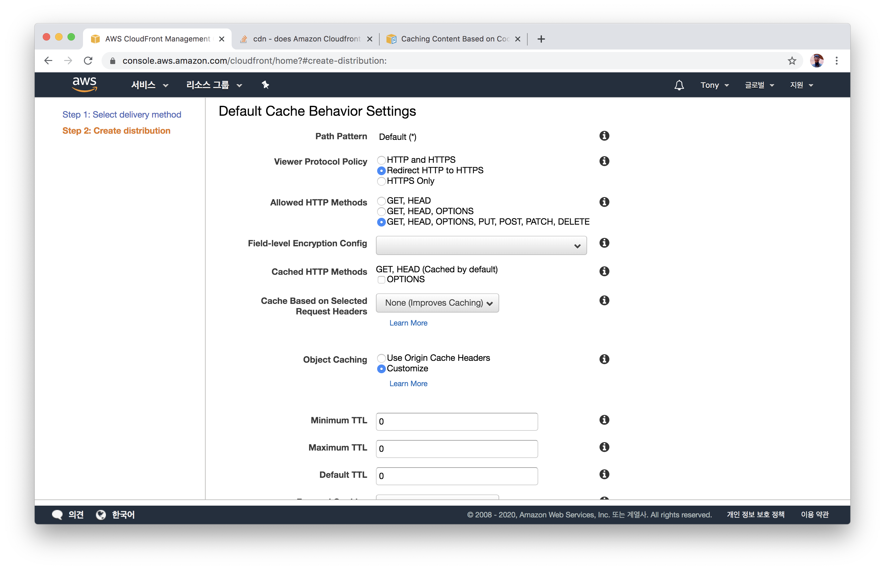

# ElastiCache(Redis) 만들고 EB와 연결하기
- AWS Console에서 Elastic Beanstalk 항목으로 이동합니다.
  

- `aws-ssr-demo-renderer-production`을 클릭합니다.
  

- `구성`탭에서 `소프트웨어` 항목의 `수정` 버튼을 클릭합니다.
  

- `환경 속성`에 차례대로 값을 주입합니다.
  - `API_ENDPOINT`는 API 서버의 엔드포인트입니다. (커뮤니티 데이 현장 데모에서는 Zeit Now를 통해 배포되어 있습니다.)
  - `REDIS_DB`는 `0`을 입력합니다.
  - `REDIS_HOST`는 `4. ElastiCache(Redis) 만들고 EB와 연결하기`에서 생성한 Redis의 엔드포인트를 넣습니다.
  - `REDIS_PORT`는 `6379`를 입력합니다.
  - `SESSION_SECRET`은 Secret으로 사용할 임의의 문자열을 입력합니다.
  - `적용` 버튼을 클릭합니다.
  

- 적용 중...
  
  

## 다음으로
0. 의존성 설치 및 프로젝트 빌드하기
1. IAM 사용자 만들기
2. EB CLI를 통해 EB 어플리케이션 만들기
3. EB CLI를 통해 EB 환경 만들기
4. ElastiCache(Redis) 만들고 EB와 연결하기
5. EB에 환경변수 주입하기
6. **CloudFront로 정적 자원 제공 가속화하기** [이동하기](../documents/6_cloudfront/README.md)
