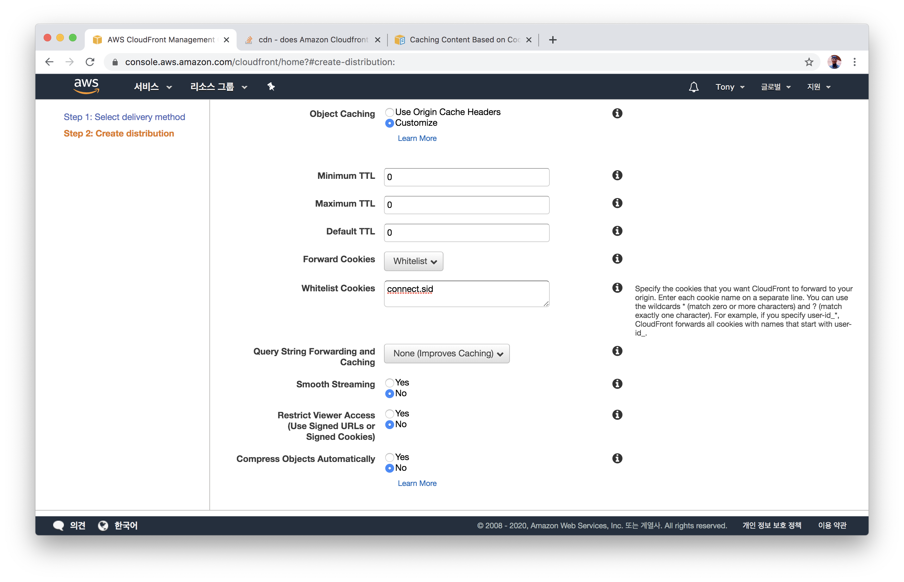
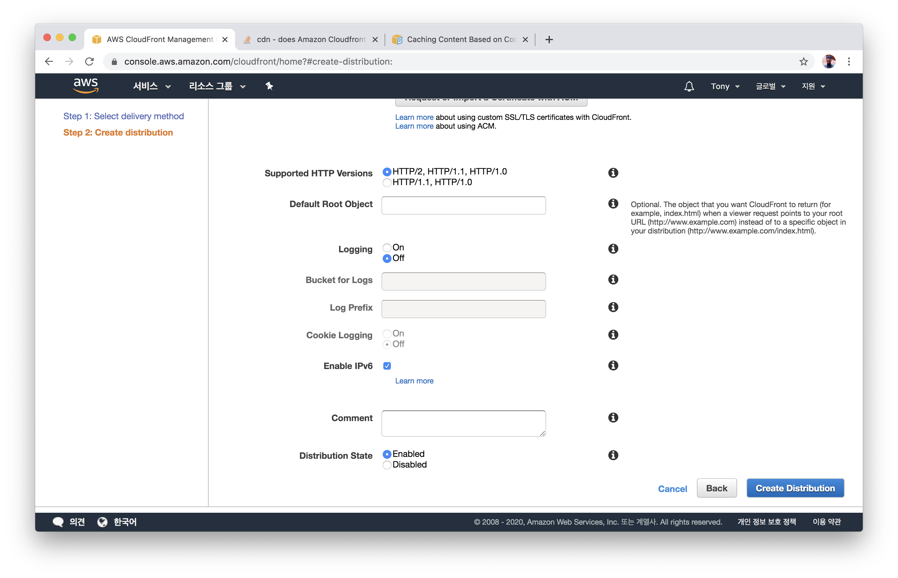
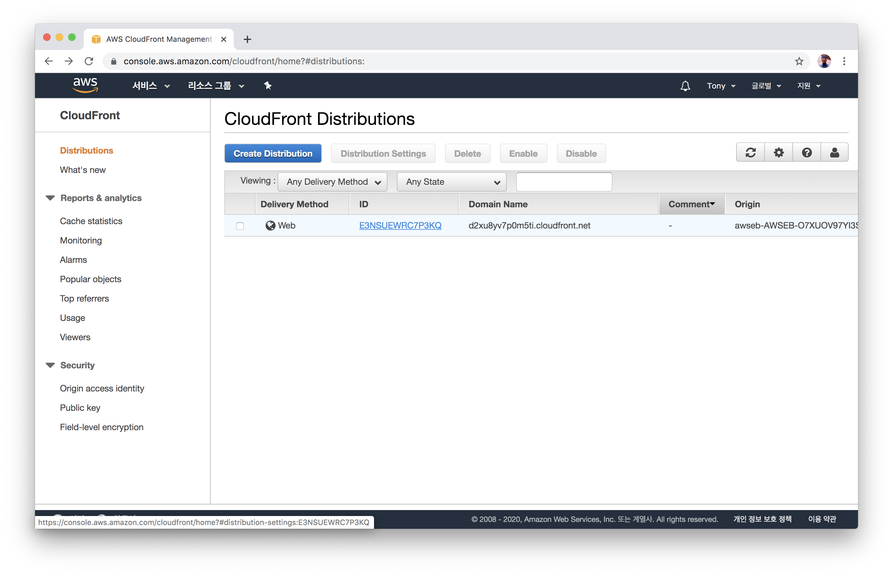
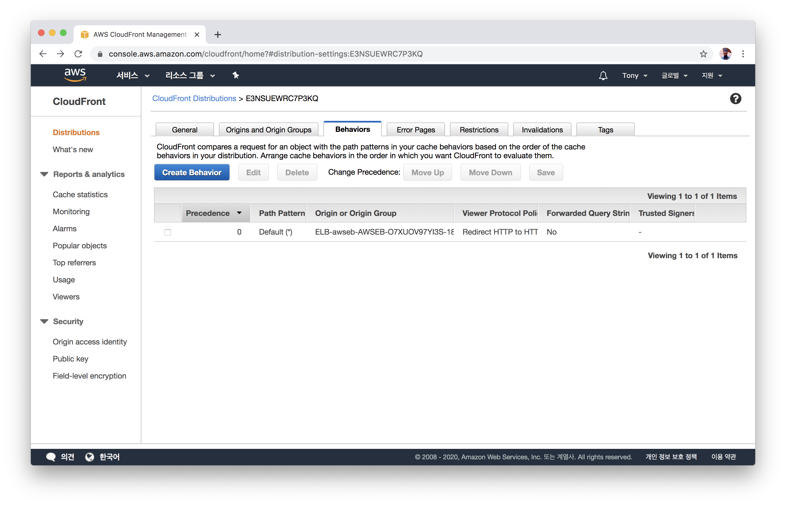
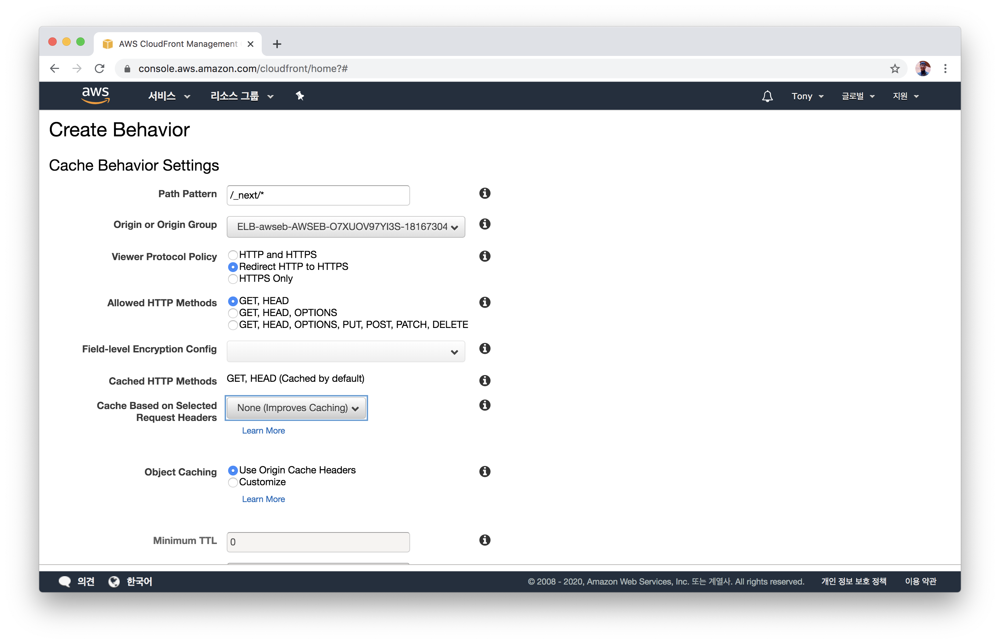
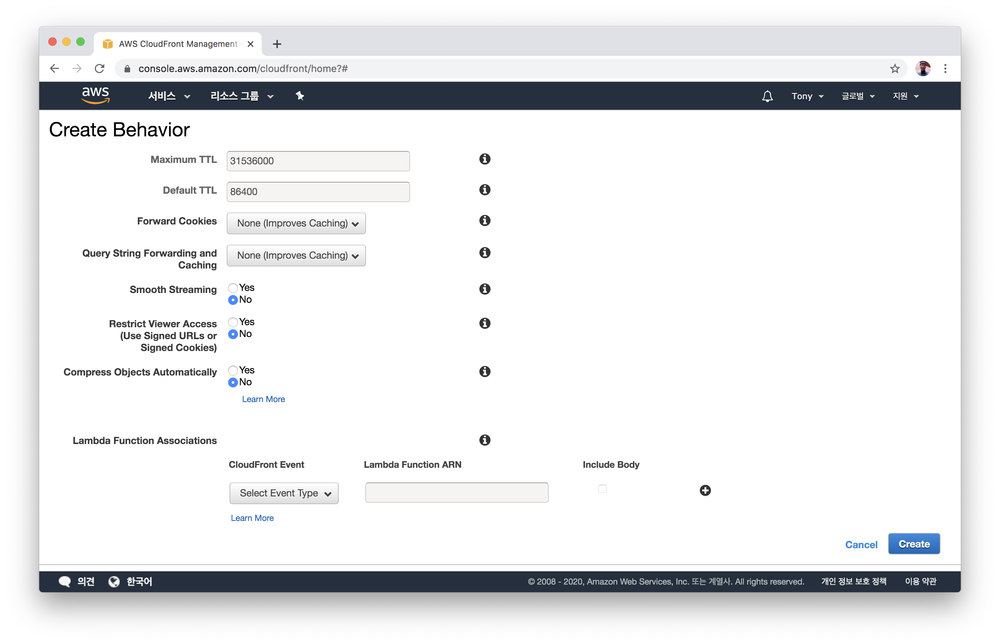

# ElastiCache(Redis) 만들고 EB와 연결하기
- AWS Console에서 CloudFront 항목으로 이동합니다.
  

- `Create Distribution`을 클릭합니다.
  

- `Web` 항목의 `Get Started`를 클릭합니다.
  

- `Origin Domain Name`에 아까 생성한 EB 환경을 선택합니다.
  

- `Viewer Protocol Policy` 항목을 `Redirect HTTP to HTTPS`로 선택합니다.
- `Allowed HTTP Methods` 항목을 `GET, HEAD, OPTIONS, PUT, POST, PATCH, DELETE`를 선택합니다.
- `Object Caching` 항목을 `Customize`로 선택합니다.
- `Minimum TTL`, `Maximum TTL`, `Default TTL`을 모두 `0`으로 설정합니다.
  

- `Forward Cookies` 항목을 `Whitelist`로 선택합니다.
- `Whitelist Cookies`에 `connect.sid`를 적어넣습니다.
  

- `Create Distribution` 버튼을 클릭합니다.
  

- Distribution 목록으로 돌아오면, 방금 만들어진 항목을 선택합니다.
  

- `Behaviors` 탭으로 이동한 뒤 `Create Behavior`를 선택합니다.
  

- `Path Pattern`에 `/_next/*`를 입력합니다.
- `Viewer Protocol Policy`를 `Redirect HTTP to HTTPS`로 설정합니다.
  

- 나머지는 모두 기본값으로 둔 뒤, 하단의 `Create`를 클릭합니다.
  

## 모든 설정이 완료되었습니다! 🎉🎉🎉
CloudFront의 Domain Name으로 접속해 잘 작동하는지 확인합니다. 또, EB 엔드포인트와 퍼포먼스 차이를 비교해봅니다.

- 처음으로 돌아가기 [이동하기](../../README.md)
